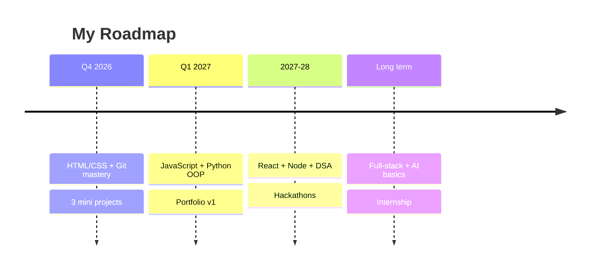

[](https://git.io/typing-svg)

<p align="center">
  <b>I build streaming apps, Telegram bots and AI-assisted tools with Python — open to freelance & internships.</b>
</p>

<p align="center">
  
  
  
  
  
</p>

> *“Small steps every day lead to big results.”* 🌱

---

## 🙋‍♂️ About Me


Hi! I'm **T Thirupathi Raja**, a first-year **B.Tech Information Technology** student from Kerala, India. 👋

I love understanding how software works — from websites and apps to problem-solving with code. I'm just starting my engineering journey and excited to grow into a skilled developer who builds useful, real-world projects.

- 📍 Based in: Kerala, India
- 🎓 College: Government Engineering College Barton Hill, Thiruvananthapuram
- 🌱 Currently: First-year B.Tech IT student (2026 batch)
- 💡 Motto: Learn by building
- ⚡ Fun fact: I enjoy exploring new tools and customizing my dev setup
- 👀 Looking for: Freelance, internships & collaboration

<br clear="right"/>

---

## 🎓 Education

| Degree | Institution | Year | Details |
|--------|-------------|------|---------|
| **B.Tech in Information Technology** | Government Engineering College Barton Hill, Thiruvananthapuram (KTU) | 2026 — 2030 | First Year, Merit Admission |
| **Higher Secondary (HSE, Plus Two)** | MGM NSS HSS Lakkattoor, Kottayam | 2024 — 2026 | 97.67% — Physics, Chemistry, Maths |
| **SSLC (10th)** | Govt. of Kerala Board | 2024 | Passed with distinction |

---

## 🛠️ Technical Skills

<p align="center">
  
</p>

### Languages


### Tools & Daily Workflow


- 🔧 **Tools:** Git, GitHub, VS Code, Linux terminal, OpenCode, Claude Code
- 🌐 **Web Basics:** HTML, CSS, basic JavaScript, React basics
- 🤖 **AI & Automation:** OpenDesign, n8n workflows, AI-assisted coding
- 📱 **Android:** Custom ROMs, rooting, system tweaks
- 🧠 **CS Fundamentals:** Problem solving, basic data structures, OOP concepts (learning)

```python
# A little about me in code 👨‍💻
def who_am_i():
    return {
        "name": "T Thirupathi Raja",
        "education": "B.Tech IT @ GEC Barton Hill",
        "portfolio": "https://tthirupathiraja.vercel.app",
        "skills": ["Python", "HTML", "CSS", "React", "Kotlin", "Git"],
        "tools": ["VS Code", "OpenCode", "Claude Code", "n8n", "OpenDesign"],
        "learning": ["Full-stack", "Android", "DSA"],
        "goal": "Freelance + internships, ship real apps",
        "open_to": ["Freelance", "Internships", "Collaboration"]
    }

print(who_am_i())
```

---

## 🚀 Featured Projects

> Real apps I've shipped — source and demos linked. Full showcase: **https://tthirupathiraja.vercel.app**

| Project | What it is | Stack | Link |
|---------|------------|-------|------|
| **🎬 Aruvi — Streaming Movie App** | Browsable catalog + playback, React web + native Kotlin Android app | React, Kotlin, Python | [tirforge/Aruvi](https://github.com/tirforge/Aruvi) |
| **📥 Telegram Leech** | Bot that fetches/mirrors files from URLs & torrents into chat | Python, Git | [tirforge/telegram-leech](https://github.com/tirforge/telegram-leech) |
| **💬 Ivy — Blog Generator & Chatbot** | Topic → structured post with title/outline/draft + Q&A chat | Python, HTML, CSS | [tirforge/ivy](https://github.com/tirforge/ivy) |
| **📄 MarkToPaper — QnA Generator** | Upload a PDF, get clean question-answer revision notes | Python | [tirforge/MarkToPaper](https://github.com/tirforge/MarkToPaper) |
| **🌐 Portfolio Website** | My homepage — bio, skills, projects, contact, freelance info | React, HTML, CSS | [tthirupathiraja.vercel.app](https://tthirupathiraja.vercel.app) |
| **📖 my-tech-journey** | This repo — my public learning diary (Task 2) | Markdown | ✅ You're here |

<p align="center">
  <a href="https://tthirupathiraja.vercel.app"></a>
</p>

---

## 💫 Areas of Interest

- 🌐 **Web Development** — Frontend + Backend, building responsive websites
- 🐍 **Python Programming** — Scripting, automation, problem solving
- 🤖 **Artificial Intelligence & Machine Learning** — Curious about how AI works
- 📱 **App Development** — Mobile & cross-platform apps in the future
- 🔐 **Cybersecurity Basics** — Understanding safe & secure software
- ☁️ **Open Source** — Learning GitHub, contributing to beginner-friendly projects

---

## 📚 Currently Learning

- [x] Git & GitHub — repos, commits, branches, pull requests
- [x] HTML & CSS — layouts, Flexbox, responsive design
- [ ] JavaScript — DOM, events, mini projects
- [ ] Python Deep-Dive — functions, file handling, OOP
- [ ] C Programming for college labs
- [ ] Data Structures & Algorithms basics
- [ ] Linux command line

**This week's focus:** ✅ Completing Task 2 — my first professional GitHub README!

<p align="center">
  
</p>

### 🗺️ Learning Roadmap



---

## 🎯 Future Goals

1. 🏗️ **Short-term (2026-2027):** Master Python + Web basics, build 5+ mini projects, maintain a clean GitHub streak
2. 💼 **Mid-term (2027-2028):** Learn full-stack (React + Node / Python backend), DSA in depth, join hackathons & tech clubs
3. 🌍 **Long-term:** Become a software engineer / AI engineer, contribute to open source, and intern at a product company
4. 🤝 **Community:** Share notes, help juniors, and document my journey in public

---

## 📊 GitHub Stats

<p align="center">
  
  
</p>

<p align="center">
  
  
</p>

---

## 📂 How to Use This Repo

```bash
git clone https://github.com/tirforge/my-tech-journey.git
```

---

## 🔗 Connect With Me

<p align="center">
  <a href="https://tthirupathiraja.vercel.app"></a>
  <a href="https://github.com/tirforge"></a>
</p>

| Platform | Link |
|----------|------|
| 🌐 Portfolio | [tthirupathiraja.vercel.app](https://tthirupathiraja.vercel.app) |
| 💻 GitHub | [github.com/tirforge](https://github.com/tirforge) |
| 💼 LinkedIn | *Coming soon — will update here* |
| 📧 Email | *Available on request* |

> ⭐ If you find my journey interesting, consider starring this repo!

<p align="center">
  
</p>

---

## 🙏 Acknowledgements

Thanks to my college mentors and the open-source community for inspiration. This README is 100% original and written by me for **Kickoff Task 2**.

*Last updated: September 2026*

### 📄 License

MIT — feel free to take inspiration, but write your own story. No copying!


